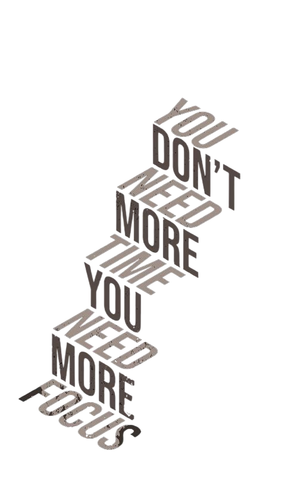
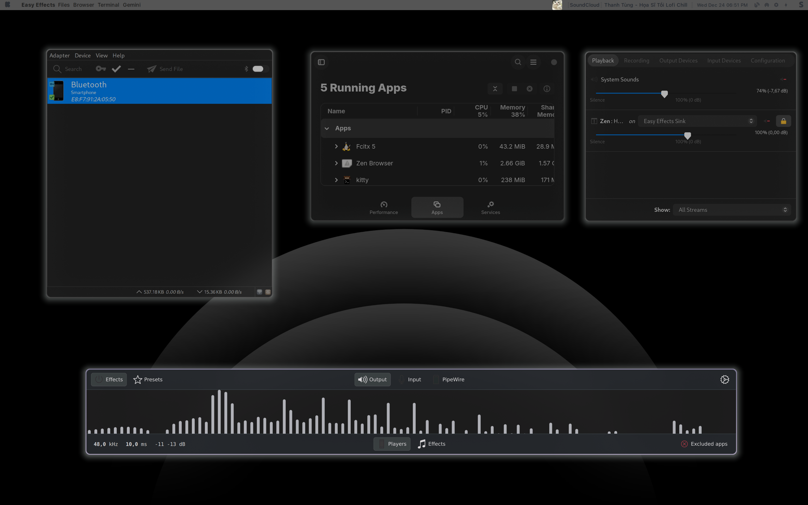
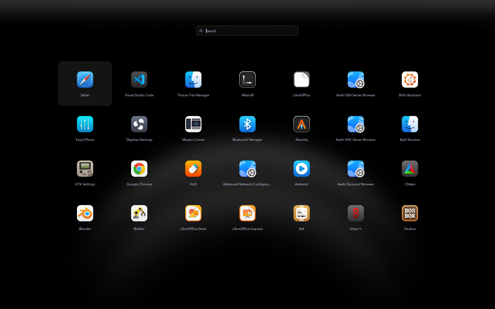
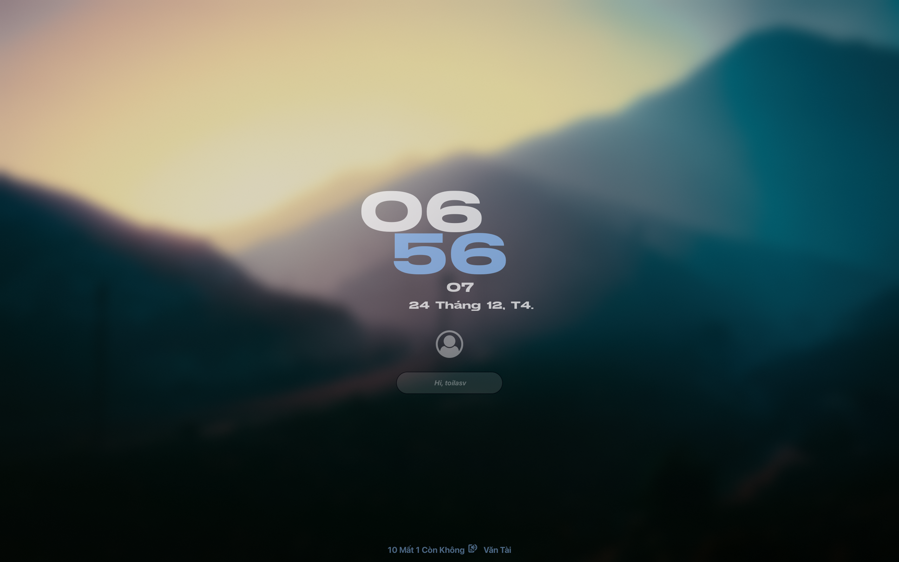

<div align="center">



<p align="center">
    <a href="https://github.com/aiwwu/.dotsfile/stargazers">
        
    </a>
    <a href="https://github.com/aiwwu/.dotsfile/network/members">
        
    </a>
    <a href="https://archlinux.org/">
        
    </a>
    <a href="https://hyprland.org/">
        
    </a>
    <a href="./LICENSE">
        
    </a>
</p>

<p>
    <b>Minimalist</b> • <b>Aesthetic</b> • <b>Performance</b>
</p>

<p>
    Welcome to my personal <b>Hyprland</b> configuration. Designed for a smooth workflow with a focus on eye-candy visuals and productivity.
</p>

</div>

---

## 🎥 Showcase

> **Note:** High-quality animations ahead. Wait a moment for them to load.

<div align="center">
    <video src="./assets/showcase.mp4" width="100%" autoplay loop muted playsinline></video>
</div>

<details>
<summary><b>📸 Click to see static screenshots</b></summary>

| File | App |
| :---: | :---: |
|  |  |

| App Launcher (Rofi) | Lock Screen |
| :---: | :---: |
|  |  |

</details>

---

## 🧩 Components

<div align="center">

| Component | Specification | Description |
| :--- | :--- | :--- |
| **OS** | [Arch Linux](https://archlinux.org) | Rolling release distro |
| **WM** | [Hyprland](https://hyprland.org) | Dynamic tiling compositor |
| **Terminal** | [Kitty](https://sw.kovidgoyal.net/kitty/) | GPU accelerated terminal |
| **Shell** | [Zsh](https://www.zsh.org/) | With [Starship](https://starship.rs/) prompt |
| **Bar** | [Waybar](https://github.com/Alexays/Waybar) | Highly customizable bar |
| **Launcher** | [Rofi](https://github.com/lbonn/rofi) | Wayland fork (lbonn) |
| **Notification** | [Dunst](https://dunst-project.org/) | Minimalist notification daemon |

</div>

---

## 🛠️ Installation

### ⚡ Automatic Install (Recommended)

Run the following command to clone and install the dotfiles automatically:

```bash
git clone [https://github.com/aiwwu/.dotsfile.git](https://github.com/aiwwu/.dotsfile.git)
cd .dotsfile
chmod +x install.sh
./install.sh